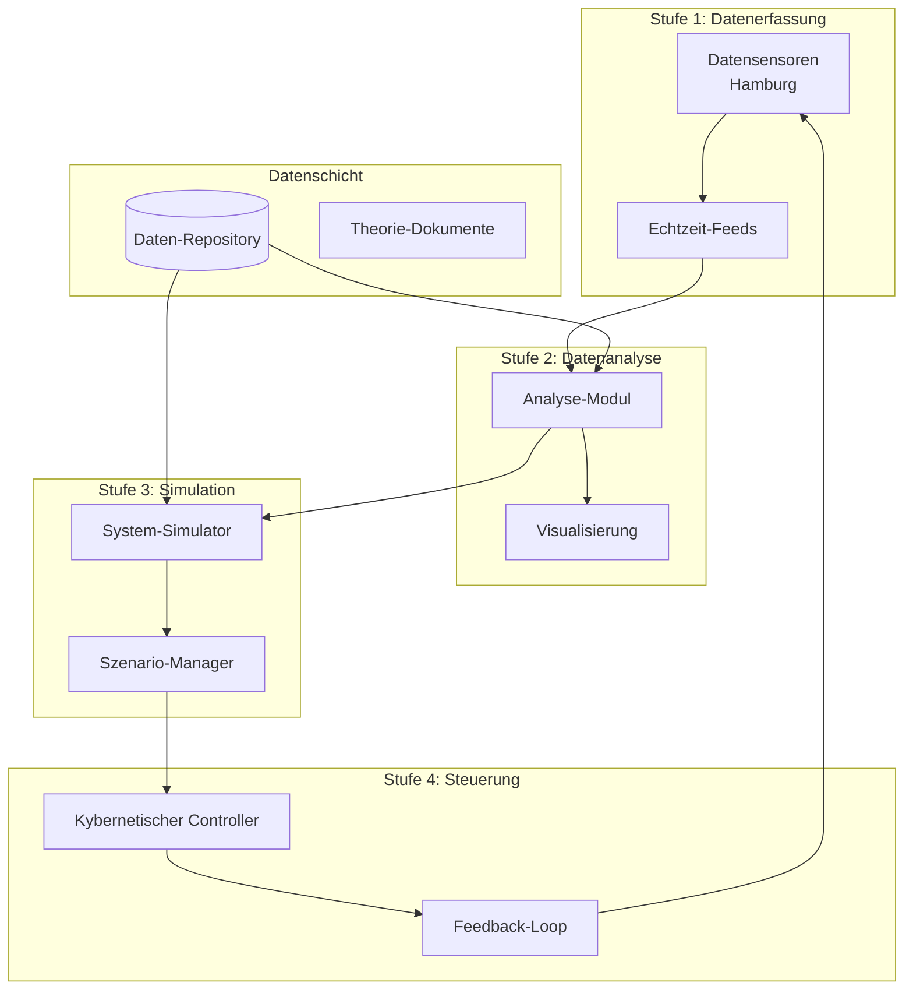

# Komponentendiagramm — Cybersyn2 Hamburg

```mermaid
graph TB
    subgraph Stufe1 ["Stufe 1: Datenerfassung"]
        Sensoren[Datensensoren\nHamburg]
        Echtzeit[Echtzeit-Feeds]
    end

    subgraph Stufe2 ["Stufe 2: Datenanalyse"]
        Analyse[Analyse-Modul]
        Visualisierung[Visualisierung]
    end

    subgraph Stufe3 ["Stufe 3: Simulation"]
        Simulator[System-Simulator]
        Szenarien[Szenario-Manager]
    end

    subgraph Stufe4 ["Stufe 4: Steuerung"]
        Controller[Kybernetischer Controller]
        Feedback[Feedback-Loop]
    end

    subgraph Daten ["Datenschicht"]
        DB[(Daten-Repository)]
        Paper[Theorie-Dokumente]
    end

    Sensoren --> Echtzeit
    Echtzeit --> Analyse
    Analyse --> Visualisierung
    Analyse --> Simulator
    Simulator --> Szenarien
    Szenarien --> Controller
    Controller --> Feedback
    Feedback --> Sensoren
    DB --> Analyse
    DB --> Simulator
```
